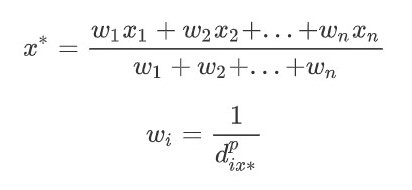

Geospatial Data Method of Estimation of HIV Burden
  

John O'Hara

**Introduction** 

Human Immunodeficiency Virus (HIV) is the a leading cause of morbidity and mortality in sub-Saharan Africa.   In 2006 they was found to be about 28.5 million people living with HIV in the region without data on  some areas of the region (Mboup et. al, 2006).  HIV is a virus that attacks the immune system that leaves victims of the disease weaker and weaker to be able combat other infections which can be fatal. HIV is considered to be an epidemic in sub-Saharan Africa while including many micro-epidemics across the continent.  With poverty wide spread in this low income nations, it's hard to collect accurate data with the lack of health care, and capital to afford censuses.  

With new methods have come significant results.  The integration of data science and that of geospatial methods has allowed researchers to be able to estimate the burden of diseases like never before.  With hope to fulfill the Sustainability Development Goal #3, researchers look to use this data to be able to help allocate resources combat the wide spread of this epidemic. With treatment such as the antiretroviral therapy (ART), which is a treatment that has been found to be successful in managing the disease.  The problem that arises it that only about 40% of the HIV population in sub-Saharan Africa are receiving this treatment (Dwyer-Lindgren, 2019).  Amartya Sen once  said that human development is the process of enhancing human capabilities such as health.  Thus allowing for people with better health to have better opportunities, such as longevity and economic opportunity.   

With most of HIV spreading through sexual intercourse there are some instant knowledge to where disease is more likely to be.  In places where there are more higher population (or hot spots) are more likely to contain more social networks that allows higher rate of spread of the disease.   Also in areas of lower population density (or cold spots)  there is less likely to be built up by social networks and in return less likely transmission rates will occur.  Other specialized areas such as locations of extreme poverty, higher drug use, and less education on safe sexual practices are prone to higher rates of HIV prevalence.  These areas where there is a depletion of social services resources are key indicators of higher rates of HIV.  Many  groups go unaccounted in datasets due to their illegal activity (such as sex workers, and injecting drug users).  

**Research and Inquiry** 

 My broad research question is that of: 

*"How to improve data science methods that are applied in the research of HIV burden in sub-Saharan Africa?"* 

Through this I am looking into a descriptive inquiry that seeks provide health profiles of inviduadals with HIV, to allow for better allocation of resources to those that are infected.  My sub research questions are that of: 

1. *How can you modify preexisting methods to be able to account for high transmission social groups?* 

 2.  *Combined with that modifying methods, how can one account for high transmission social groups in datasets?* 

These relate to my descriptive inquiry because of their focus on seeking and identifying out individuals that are affect by this disease.  This showing the importance of actually inclusion of the most at risk individuals in the solving of this human development process. 

**Geospatial Data Science Methods**

There have been many different data science methods that have been applied to be able to close the gap between these outdated/ unreliable data sets and exact estimation.  The 2 methods that my research has been focused on are that of Inverse Distance weighted (IDW) algorithm and the Bayesian method.   

##### Inverse Distance Weighted (IDW) algorithm 

First up is the Inverse Distance Weighted (IDW) algorithm.  In research done by *Zulu et al*., they used the IDW method to look at spatial variation of HIV and extract HIV prevalence to be able to predict prevalence for the future.  The basic IDW equation is that of:

$$x^*=\frac{w_1x_1+w_2x_2+...+w_nx_n}{w_1+w_2+...+w_n}$$ 

$$

w_i= \frac{1}{d^p_{ix*}}

$$ 

In the first equation,  x* is the unknown value, w is the weight,  and x is the known point.  The weight has an inverse distance of a point from each of the given known point values. The weight of each point is determined in the second equation.  In that equation, a P variable is that which is a power.  The lower the P value the higher weight it will obtain and vice versa.   d is the distance from the known given point.  This interpolation technique is used to estimate values that have other known values around it allowing for them to be able to "weigh in" on the prediction. 

Using a data set from that the United States Census Bureau, researchers inputted the data into the method.  Using the IDW to calculate the weight of influence that each measured point had on locally unmeasured locations.  Assigning more weight to measured values that are closest and lesser weight to measured values that are farther away.  The IDW uses a cross-validation that reflects an optimal power value (p) that gives the lowest root mean square prediction error.  After doing many iterations they settled on that of 12 measured points around the prediction point, with a resolution of 1 km.  This bottom up approach is seen as successful in predicting unmeasured locations, as well as predicting the future with data from previous years.  They were able to estimate well in data rich countries but in countries that were filled with poverty were seen with more uncertainty. 

**Figure 1** shows that of the surveillance data points that were used in the research.  This vector map shows the distribution of those data points (Zulu et al., 2014) 

##### Bayesian Method

Next is that of the Bayesian method.  The Bayesian method is a version of a Kriging method that is a bottom up approach that uses distance decay to predict unmeasured locations.  Bayesian method set themselves apart by accounting for the error introduced by estimating the underlying semivariogram.

In research done by *Dwyer-Lindgren et al*.,  they focused on trying to map the HIV prevalence in sub-Saharan Africa.  They looked at a 5x5 km resolution in sub-Saharan Africa to be able to estimate HIV in adults 15-49 years.  Using data from 134surveys in 41 countries and 9,794 site-years of sentinel surveillance of antenatal care clinics in 46 different countries in sub-Saharan Africa, combined with world pop data that has preexisting covariates of population factors (total population, population density, night time lights, urbanicity) .  They adapted these preexisting covariates with new covariates such as: 

- prevalence of male circumcision 
- prevalence of condom use
- prevalence of multiple partners 

Stacking these generalized/regression covariate models allows for prediction methods to increase in validity.   The use of these covariate allows for the regression/distance decay of HIV prevalence in measured areas to be established in unmeasured areas at a higher reliability.  These covariate weights allow for the mapping on top of different geospatial covariates too.  To model they used, used the spatially and temporally linear mixed effect model

$$
{Y}_{i,t}\sim {\rm{b}}{\rm{i}}{\rm{n}}{\rm{o}}{\rm{m}}{\rm{i}}{\rm{a}}{\rm{l}}({p}_{i,t},{N}_{i,t})
$$

$$
{\rm{logit}}\left({p}_{i,t}\right)=\;{\beta }_{0}+\;{{\boldsymbol{\beta }}}_{1}{{\boldsymbol{X}}}_{i,t}+{\gamma }_{c\left[i\right]}+\;{Z}_{i,t}+\;{\epsilon }_{i,t}+({\beta }_{2}+\;{U}_{i}){I}_{{\rm{ANC}}}
$$

$$
{\gamma }_{c[i]}\sim {\rm{n}}{\rm{o}}{\rm{r}}{\rm{m}}{\rm{a}}{\rm{l}}(0,\,{\sigma }_{{\rm{c}}{\rm{o}}{\rm{u}}{\rm{n}}{\rm{t}}{\rm{r}}{\rm{y}}}^{2})
$$

$$
{Z}_{i,t}\sim {\rm{G}}{\rm{P}}(0,\,{{\rm{\Sigma }}}_{{\rm{s}}{\rm{p}}{\rm{a}}{\rm{c}}{\rm{e}}}\otimes \,{{\rm{\Sigma }}}_{{\rm{t}}{\rm{i}}{\rm{m}}{\rm{e}}})
$$

$$
{\epsilon }_{i,t}\sim {\rm{n}}{\rm{o}}{\rm{r}}{\rm{m}}{\rm{a}}{\rm{l}}(0,\,{\sigma }_{{\rm{n}}{\rm{u}}{\rm{g}}{\rm{g}}{\rm{e}}{\rm{t}}}^{2})
$$

$$
{U}_{i}\sim {\rm{G}}{\rm{P}}(0,\,{{\rm{\Sigma }}}_{{\rm{s}}{\rm{p}}{\rm{a}}{\rm{c}}{\rm{e}}})
$$

Y standing for positive sample of HIV while N stands for the sample, with i as location, and t as the year. The covariance functions can be to seen in the summation of space, and that of time.  Also that of U is modeled as Gaussian process, which is modeled by that of a bell shaped curve. 

Stacking these generalized/regression covariate models allows for prediction methods to increase in validity.   The use of these covariate allows for the regression/distance decay of HIV prevalence in measured areas to be established in unmeasured areas at a higher reliability.  These covariate weights allow for the mapping on top of different geospatial covariates too.  This method has been found to be very successful in the practice of estimation of epidemiology.  **Figures 1** and **2** are the final product of the research, helping to map both the prevalence and that of the uncertainty of the results. 

**Figure 2** shows a raster map with the prevalence rates mapped with that of resolution in ascending order.  From the prevalence of HIV of countries to that of a higher resolution of  5x 5-km grid cells (Dwyer-Lindgren *et al*., 2019).

**Figure 3** is a raster map that expresses uncertainty against that of HIV prevalence in sub-Saharan Africa of the research that was conducted. This can be useful for further research focused on decreasing uncertainty in the areas of high uncertainty. This can be evident in countries with out of date or incomplete datasets (Dwyer-Lindgren *et al*., 2019).

**Results**

​	The Inverse Distance Method was found to actually be more powerful in prediction method versus Kriging Methods.  This does not take into account Bayesian methods taking into account error that is introduced in the process.  The two are both interpolation techniques that are used heavy in data science in especially in human development research.  It is safe to say that they can go hand in hand in trying to solve HIV prevalence such as using Bayesian methods to locate a certain population group, and using IDW algorithm to integrate the HIV data sets into those specific groups.  Plus the use of IDW can be use more heavily in the prediction of HIV in future too. 

The area were both of these researches show the biggest gap is due to the datasets being outdated and inaccurate.  The gap also includes a huge missing part of high risk population.  With missing data like that of sex workers and drug users you miss out on a large part of the population that has extremely high transmission rate.  Along with it is that of countries that data that is very outdated. Thus of the likes of The Democratic Republic of the Congo.  Why are they shown of having such a very little prevalence rate when we know they are one of the more impoverished nations in Africa.  This shows another huge gap in the dataset with the countries such as South Africa being more developed allowing for more access to data sets.  Going forwarded from research like this I look forward to giving a proposal for my research question to try to figure out how to solve this development problem. 

***Work Cited***

Zulu, L. C., Kalipeni, E., & Johannes, E. (2014). Analyzing spatial clustering and the spatiotemporal nature and trends of HIV/AIDS prevalence using GIS: the case of Malawi, 1994-2010. *BMC infectious diseases*, *14*, 285. https://doi.org/10.1186/1471-2334-14-285

Dwyer-Lindgren, L., Cork, M.A., Sligar, A. *et al.* Mapping HIV prevalence in sub-Saharan Africa between 2000 and 2017. *Nature* **570,** 189–193 (2019). https://doi.org/10.1038/s41586-019-1200-9

Mboup S, Musonda R, Mhalu F, et al. HIV/AIDS. In: Jamison DT, Feachem RG, Makgoba MW, et al., editors. Disease and Mortality in Sub-Saharan Africa. 2nd edition. Washington (DC): The International Bank for Reconstruction and Development / The World Bank; 2006. Chapter 17. Available from: https://www.ncbi.nlm.nih.gov/books/NBK2289/
